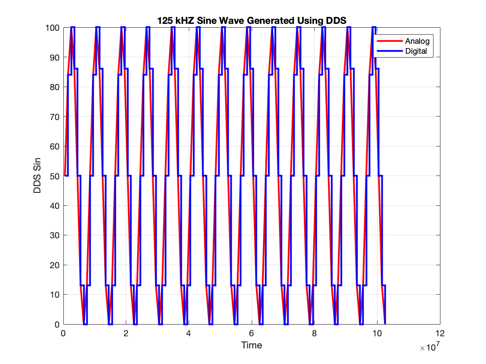

# Direct Digital Synthesizer Design in Verilog

## What is DDS?

Direct digital synthesis (DDS) is a technique utilized by frequency synthesizers to generate arbitrary waveforms from a single, fixed-frequency reference clock. DDS finds application in signal generation, local oscillators for communication systems, function generators, mixers, modulators, sound synthesizers, and digital phase-locked loops.

## Project Focus

This project involves creating a Direct Digital Synthesizer to:
- Generate Discrete-Time Sine Waves of Different Frequencies in the range of 10kHz - 250kHz.
- The Waves are generated with a 10-bit Digital Representation.
- We later use Matlab to plot the 10-bit digital output.
- The Master Clock of the system is 1MHz.

## Architecture

The architecture planned for developing a DDS, is such that it is broken down into 2 distinct modules. First we have a ``Phase Accumulator`` and then we have a ``Phase to Amplitude`` Module which outputs the desired sine waves.

### Phase Accumulator

- This module basically acts as a cyclic counter. 
- Basically producing output phases of a Sine Wave. 
- It takes as input a ``Frequency Select Word (FSW)``. 
- This value is stored in a 10-Bit Register. 
- This value sets the increments that the phase counter should take.
- This is what actually sets the frequency of the Sine Wave generated.
- This mechanism allows us to vary the frequency of the Sine Wave generated.
- The maximum value of the counter will be 1024, being a 10-Bit 
- It starts of with 0 and at every clock cycle it increments the value set by FSW to the counter value. 
- It keeps doing this till it fills up the 10-bit counter register, which means when the value exceeds 1024.

### Phase To Amplitude 

- This module basically acts like a look up table (LUT).
- After every increment of the Phase Accumulator, this model assigns a particluar Sine Wave Amplitude based on the current counter value.
- However to avoid signed number representation in verilog, the generated sine waves has an offset of 50.
- Which means that the starting amplitude of sine waves is 50.
- Max amplitude is 100.
- Min amplitude is 0.

## Verilog Top Module Schematic Generated

It can be seen that this Vivado Schematic is pretty much same as what was originally proposed. You
can see a 10 bit fsw going into phase counter which is our phase accumulator and then the counter
value going to phase to amplitude block where it assigns a specific amplitude to that counter value,
giving us a digital sine wave as output.

## Generated Sine Waves (Plotted in Matlab)

The Amplitude values at every clock cycle along with the counter value are printed in the logs in the testbench. So that we could take the output, put it in the text files and import them in Matlab, to plot the sinewaves generated in verilog.

### 10kHz Sine Wave

### 50kHz Sine Wave

### 125kHz Sine Wave

### 200kHz Sine Wave

### 250kHz Sine Wave

--- 

**Contributions**: All of the code in this repository is written by [Huzaifah Tariq Ahmed](https://github.com/huzaifahtariqahmed). 
